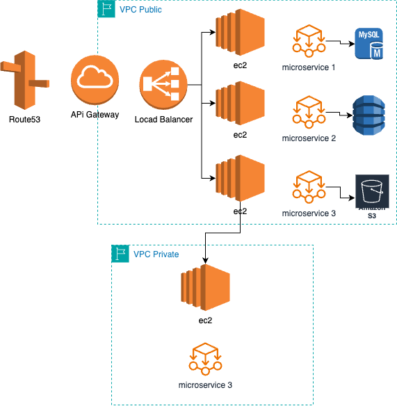

# Designing and Simulating AWS Cloud Architectures

## Parte 1: Diseño de la Infraestructura en la Nube

### Componentes de la Arquitectura

-   Amazon EC2
    -   Servidores Web: Instancias EC2 para alojar la aplicación web.
-   Amazon S3

    -   Almacenamiento de Contenido Estático: Almacenar recursos estáticos como imágenes, archivos CSS y JavaScript.
-   Amazon VPC
    -   Subredes: Subredes separadas para diferentes niveles (público y privado).
        -   Subred Pública: Aloja los servidores web y los balanceadores de carga.
        -   Subred Privada: Aloja los servidores de aplicación y bases de datos.
    -   Internet Gateway: Permite el acceso a internet público para los servidores web.

-   Amazon RDS

    -   Instancias de Base de Datos 
        -   Servicio de base de datos gestionado para manejar los datos de la aplicación.

-   Amazon Route 53

    -   Servicio DNS   
        -   Para la resolución de nombres de dominio y enrutamiento del tráfico a la aplicación.

## Diagrama

## Parte 2: Configuración de IAM

Roles y Políticas:

-   Desarrolladores:
    -   Acceso a EC2, S3 para monitoreo y despliegue.
    -   Políticas de solo lectura para S3 y acceso completo a las instancias EC2 específicas del entorno de desarrollo.

-   Administradores:

    -   Acceso completo a todos los recursos para gestión y mantenimiento.
    -   Políticas que permiten la gestión de IAM, EC2, S3, RDS y VPC.

-   Servidores de Aplicaciones

    -   Políticas que permiten acceso a S3 (lectura/escritura) para almacenar y recuperar datos.
    -   Acceso limitado a otros servicios necesarios como RDS para conectarse a la base de datos.

## Parte 3: Estrategia de Gestión de Recursos

-   Auto Scaling

    -   Configurar grupos de autoescalado para instancias EC2, ajustando automáticamente la cantidad de instancias según la demanda.
-   Elastic Load Balancing (ELB)

    -   Implementar balanceadores de carga para distribuir el tráfico de manera uniforme entre las instancias EC2.

## Parte 4: Implementación Teórica

-   Los usuarios acceden a la aplicación a través de Internet y son dirigidos mediante Route 53.
-   El tráfico es manejado por el Internet Gateway y distribuido a través del balanceador de carga.
-   El balanceador de carga dirige el tráfico a las instancias EC2 en la subred pública.
-   Las instancias EC2 en la subred pública manejan las solicitudes web y se comunican con las instancias de aplicación en la subred privada.
-   Las instancias de aplicación interactúan con la base de datos RDS para operaciones CRUD.
-   Los recursos estáticos son servidos directamente desde S3.

## Parte 5: Discusión y Evaluación

-   Elección de Servicios

    -   EC2 y RDS para flexibilidad y gestión de carga.
    -   S3 para almacenamiento económico y escalable de contenido estático.
    -   VPC para aislar y proteger recursos dentro de subredes.

-   Políticas de IAM

    -   Las políticas de IAM aseguran que los usuarios y servicios tengan solo los permisos necesarios, minimizando riesgos de seguridad.

-   Scalability
    -   Auto Scaling y ELB aseguran que la aplicación pueda manejar aumentos repentinos en el tráfico sin comprometer el rendimiento.